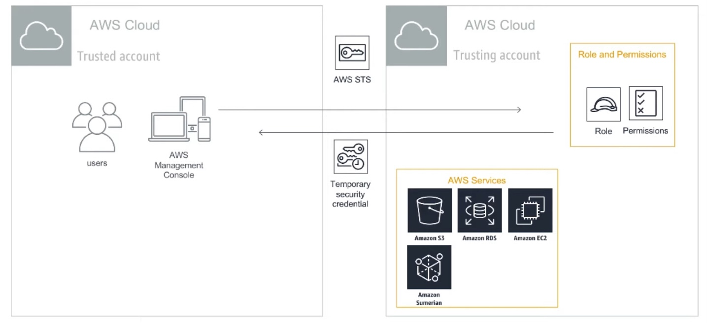
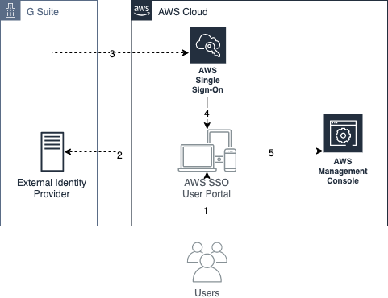
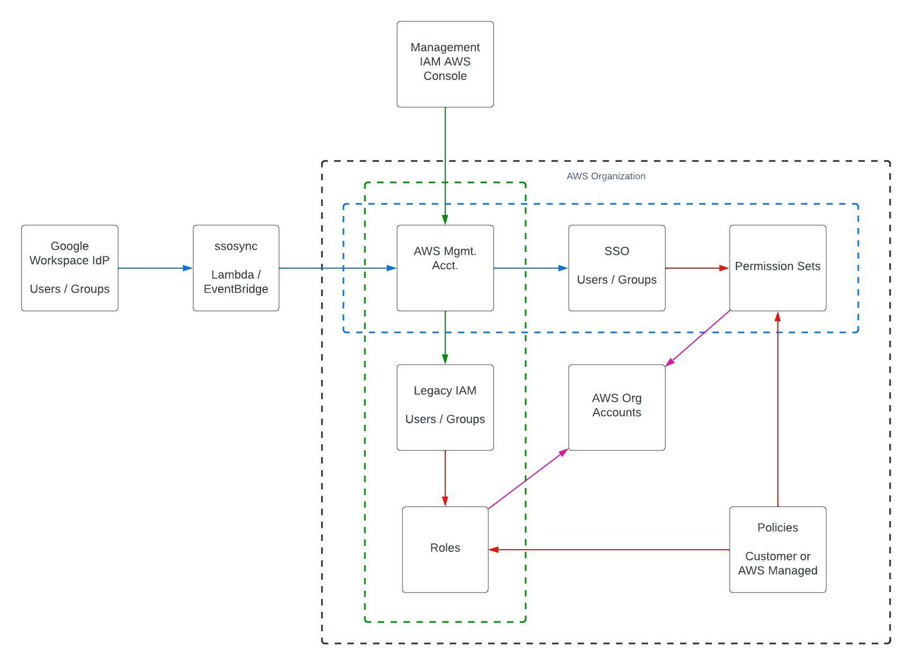
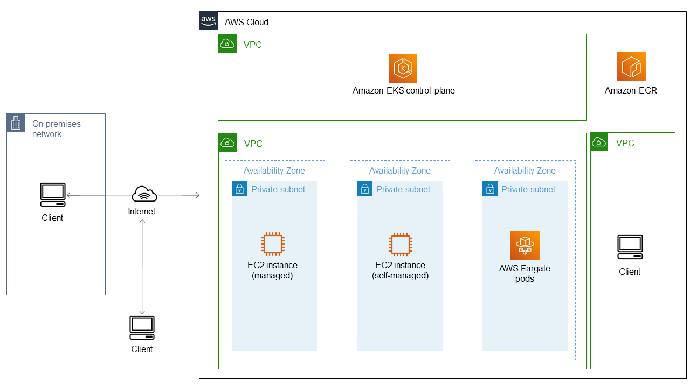
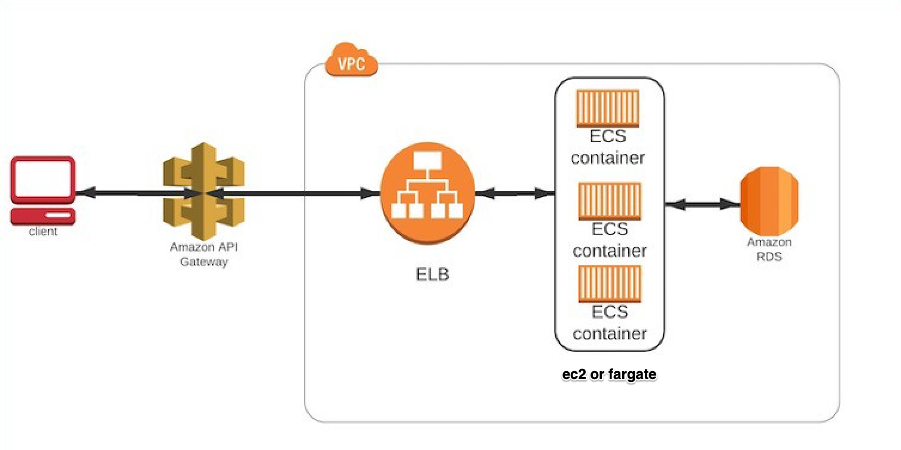
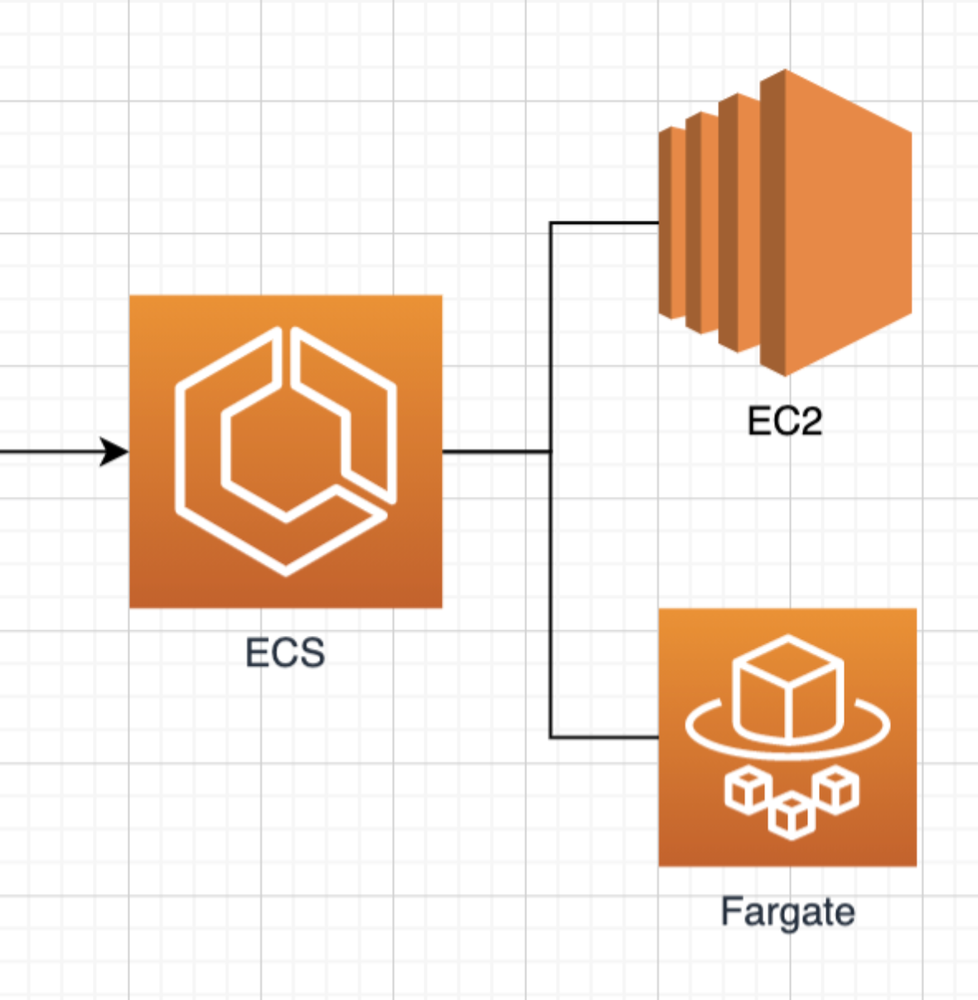
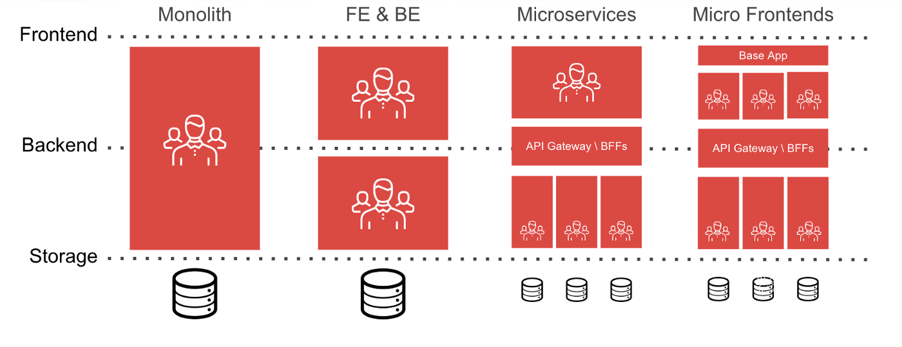
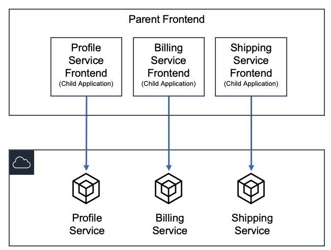
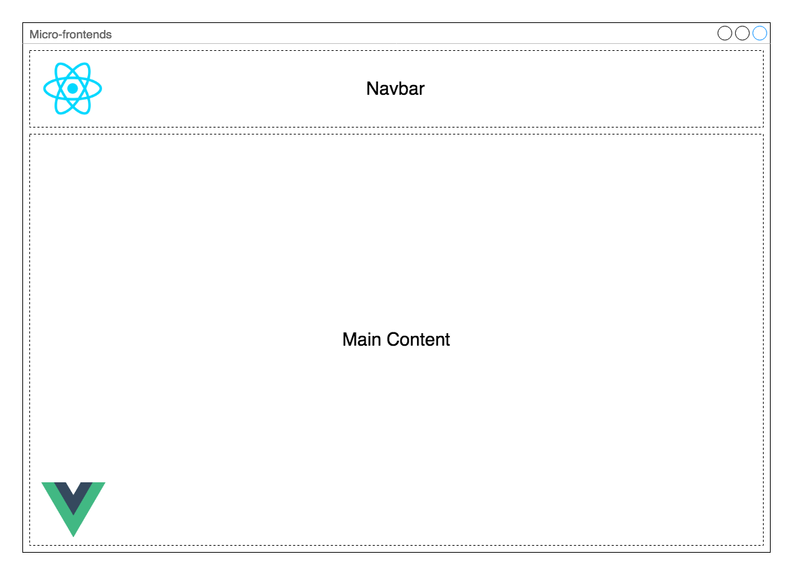

```code
   _____                          
  / ___/___  ______   _____  _____
  \__ \/ _ \/ ___/ | / / _ \/ ___/
 ___/ /  __/ /   | |/ /  __/ /    
/____/\___/_/    |___/\___/_/     
                                  
    ___        __    _ __            __                
   /   | _____/ /_  (_) /____  _____/ /___  __________ 
  / /| |/ ___/ __ \/ / __/ _ \/ ___/ __/ / / / ___/ _ \
 / ___ / /__/ / / / / /_/  __/ /__/ /_/ /_/ / /  /  __/
/_/  |_\___/_/ /_/_/\__/\___/\___/\__/\__,_/_/   \___/ 
```

## Cloud Server Infrastructure Management and Visualization <!--fit-->

The required strategies for managing the resources efficiently

---

## What is covered in the presentation?

* AWS Organization
    * Identity and Access Management (IAM)
    * Single Sign-On (SSO) with Google Workspace
* AWS Resources and Workloads
    * Applications
    * Data Processing
* Infrastructure Team Methodologies and Toolings
    * Graphical and Visualization Exchange
        * Slack
    * Documentation
        * Git Repository
        * Confluence
---

## AWS Organization

The foundation of a well-managed infrastructure


---

### Identity and Access Management (IAM)

Is a web service that helps you securely control access to AWS resources

---

#### Managing Organization Units (OUs)

`Scenario 1`
```code
Root OUs
├── Operations Management
├── Production
└── Development
```

`Scenario 2`
```code
Root OUs
├── Main OUs
│   └── Operations Management
├── Workloads OUs
│   ├── Production
│   └── Development
├── Business Intelligence OUs
│   └── Data Pipeline
└── Other Company Accounts OUs
    └── Data Source Account
```

---

#### Assume Role Across Organization Units Account




---

#### Google Workspace as an external identity provider for AWS SSO



---

#### IAM and SSO in a Whole Picture




---

## Orchestrated Services

### Amazon Kubernetes Service (Amazon EKS)
### Amazon Elastic Container Service (Amazon ECS)

---

#### Amazon Kubernetes Service (Amazon EKS)



---

#### Amazon Elastic Container Service (Amazon ECS)


* EC2 Compute, or
* ECS/Fargate

---

## Microservice and Serverless Architecture

### Amazon ECS/Fargate
### Amazon Lambda

---

#### Amazon ECS/Fargate



---

#### Amazon Lambda


---

### Evolution of Software Architecture



---

### Example: Micro-Frontend Architecture



---

### Example: Micro-Frontend UIs




---

### Infrastructure Team Methodologies and Toolings

#### DEMO
